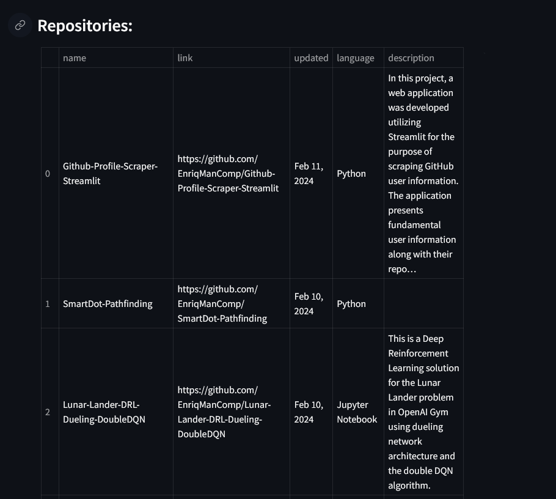

# Github-Profile-Scrape-Streamlit

In this project, a web application was developed utilizing Streamlit for the purpose of scraping GitHub user information. The application presents fundamental user information along with their repositories.

## Check scraping rules
Verify if there are some restriction policy to get the user information in the next URL: <code>https://github.com/robots.txt</code>

## Required Libraries
```python

pip install beautifulsoup4, streamlit

```

## Gathering github profile data

<p>The URL <code>https://github.com/{user_name}?tab=repositories</code> contains the user's information and their public repositories. The contents of the page will be obtained using the requests library.</p>
Subsequently, the relevant user data can be found using the BeautifulSoup library.

## Relevant data fields
The following user information will be scrape from the page requested:
### Information about the user
- Username
- Image
- Number of followers
- Number of users following
- Location
- Portfolio or website URL
### Information about user's repositories.
- Name
- URL
- Last update
- Programming language used
- Description

## Run streamlit app
To run the streamlit app on localhost, you need to execute the following command in the console:

```cmd
streamlit run streamlit_app.py
```
## Example
<div align="center">
  
  
</div>

